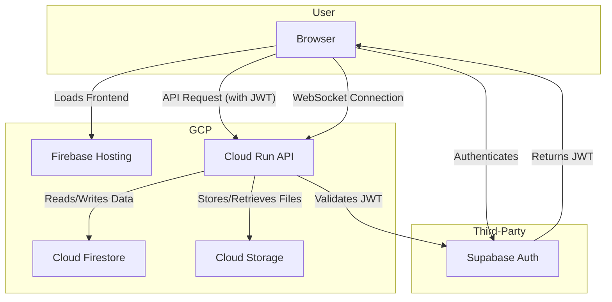

# Simple GCP Architecture for Wellness & Study App

## Overview

This document outlines a simple, serverless, and cost-effective architecture on Google Cloud Platform (GCP) for the Wellness & Study App hackathon. This setup is designed for rapid development and deployment, leveraging generous free tiers to minimize costs.

## Core Services

*A visual representation of the architecture.*

### 1. Frontend Hosting: **Firebase Hosting**

-   **What it is**: A fully managed hosting service for static and dynamic web apps.
-   **Why we're using it**:
    -   **Simplicity**: One-command deployments (`firebase deploy`).
    -   **Global CDN**: Fast content delivery worldwide.
    -   **Free SSL**: Automatic SSL certificate provisioning.
    -   **Generous Free Tier**: 10 GB storage, 360 MB/day data transfer.
-   **How it works**: Hosts the compiled frontend (e.g., React, Vue, Angular) and serves it to users.

### 2. Backend Hosting: **Cloud Run**

-   **What it is**: A serverless platform to run stateless containers.
-   **Why we're using it**:
    -   **Simplicity**: Deploy a container without managing servers.
    -   **Pay-per-use**: You only pay when your code is running.
    -   **Scales to Zero**: If there's no traffic, it scales down to zero instances, costing nothing.
    -   **Generous Free Tier**: 2 million requests per month.
-   **How it works**: Hosts our FastAPI backend application as a Docker container.

### 3. Database: **Cloud Firestore**

-   **What it is**: A flexible, scalable NoSQL document database.
-   **Why we're using it**:
    -   **Schemaless**: No need for complex migrations; perfect for rapid development.
    -   **Easy to Use**: Simple SDKs for Python.
    -   **Generous Free Tier**: 1 GiB storage, 50k reads/day, 20k writes/day.
-   **How it works**: Stores all application data, like user profiles, tasks, journal entries, and community posts.

### 4. File Storage: **Cloud Storage**

-   **What it is**: An object storage service for files of any size.
-   **Why we're using it**:
    -   **Durable & Available**: Industry-leading reliability.
    -   **Simple API**: Easy to upload and retrieve files from the FastAPI backend.
    -   **Generous Free Tier**: 5 GB-months of standard storage.
-   **How it works**: Stores user-uploaded files, such as audio journals and profile avatars.

### 5. Authentication: **Supabase**

-   **What it is**: An open-source Firebase alternative.
-   **Why we're using it**:
    -   You're already using it for authentication.
    -   Provides user management and JWT-based authentication out of the box.
-   **How it works**: The frontend communicates with Supabase to sign up/log in users. Supabase issues a JWT, which is then sent to our Cloud Run backend for API request authorization.

## Architecture Flow

Here is a step-by-step flow of how the services interact:

1.  **User Accesses Frontend**: The user navigates to your app's URL, and the frontend assets are served from **Firebase Hosting**.
2.  **User Authentication**:
    -   The frontend redirects the user to a Supabase login/signup page.
    -   Upon successful authentication, **Supabase** returns a JWT (JSON Web Token) to the frontend.
3.  **API Requests**:
    -   For any backend operation (e.g., fetching tasks), the frontend makes an API call to the **Cloud Run** backend, including the Supabase JWT in the `Authorization` header.
4.  **Backend Processing**:
    -   **Cloud Run** receives the request.
    -   A middleware in the FastAPI app validates the JWT to ensure the user is authenticated.
    -   The backend logic interacts with **Cloud Firestore** to read or write data (e.g., fetching a user's tasks).
    -   If the request involves file uploads (like a voice journal), the backend uses the Cloud Storage SDK to save the file to a **Cloud Storage** bucket.
5.  **Real-time Chat (WebSocket)**:
    -   The frontend establishes a WebSocket connection to the **Cloud Run** backend for a specific community group.
    -   Cloud Run manages the connection, broadcasting messages to all connected clients in that group and persisting messages to **Cloud Firestore**.

## Deployment Strategy

### Frontend (Firebase Hosting)

1.  **Install Firebase CLI**: `npm install -g firebase-tools`
2.  **Initialize Firebase**: `firebase init hosting`
3.  **Build Your Frontend**: `npm run build` (or equivalent)
4.  **Deploy**: `firebase deploy`

### Backend (Cloud Run)

1.  **Create a `Dockerfile`** for your FastAPI application.
2.  **Build the Docker image**: `docker build -t gcr.io/your-gcp-project-id/wellness-app .`
3.  **Push the image to Artifact Registry**: `docker push gcr.io/your-gcp-project-id/wellness-app`
4.  **Deploy to Cloud Run**: Use the `gcloud run deploy` command or the GCP console to deploy the container image.
    -   Configure environment variables (database credentials, API keys, etc.).
    -   Ensure "Allow unauthenticated invocations" is enabled if you want it to be a public API (the JWT will handle authorization).

## Diagram (Mermaid)

